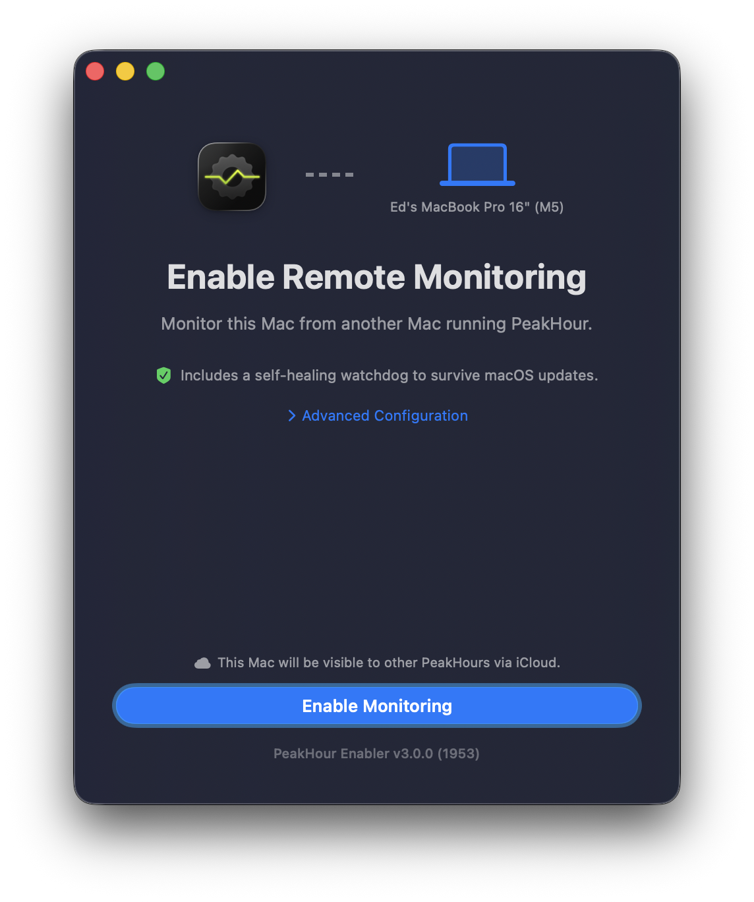
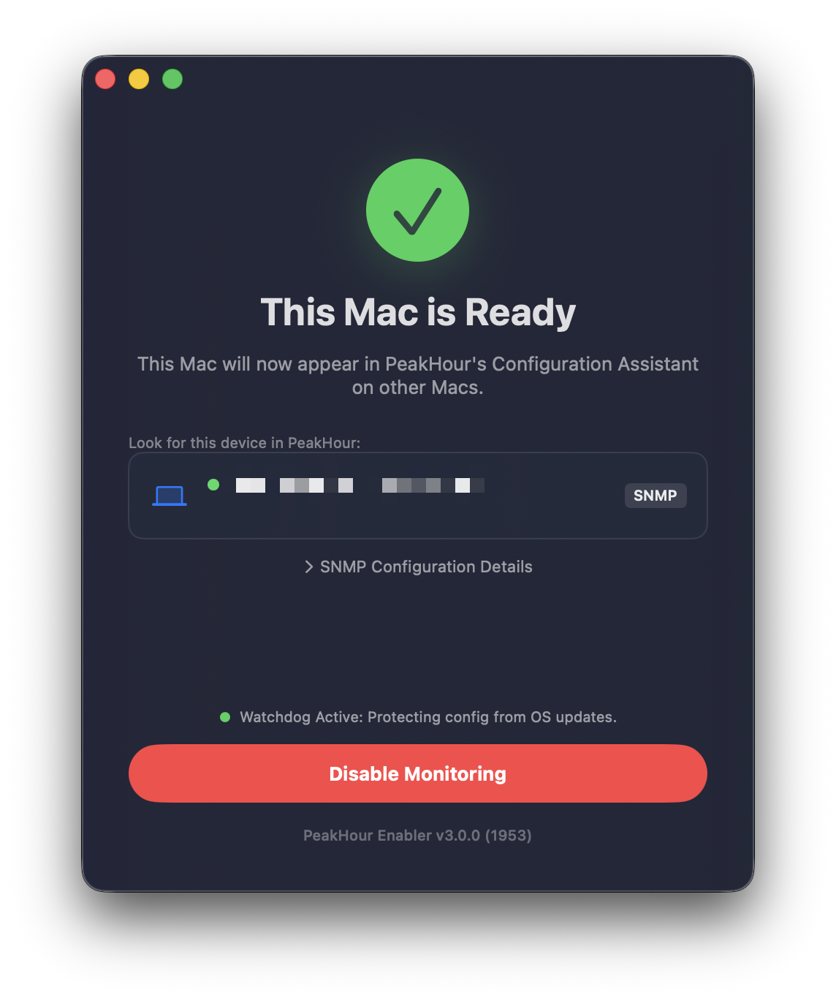

# PeakHour Enabler

PeakHour Enabler is a small macOS utility that helps configure the built-in `snmpd` service so a Mac can be monitored by PeakHour from another Mac on the network.

The app is intentionally narrow: it reads the local SNMP configuration, can generate an SNMP community string, enables remote access for the current local network, starts or restarts `snmpd`, and automatically shares this Mac's monitoring configuration with PeakHour via iCloud configuration.

PeakHour Enabler is designed to work with PeakHour, the main macOS Internet performance monitoring app. Learn more about PeakHour at [peakhourapp.com](https://peakhourapp.com/).

## Download

[](https://github.com/EpaL/PeakHour-Enabler/releases/latest)

Grab the latest build from the [**Releases page**](https://github.com/EpaL/PeakHour-Enabler/releases/latest), or [build it from source](#building).

## Usage

### Enable monitoring

On the Mac you want to monitor, open **PeakHour Enabler** and click **Enable Monitoring**. Authenticate with an administrator password when prompted — PeakHour Enabler configures and starts `snmpd` and opens SNMP access to your local network.



- **Advanced Configuration** lets you review or adjust the SNMP settings before enabling.
- A self-healing **watchdog** re-applies the configuration after macOS updates, so monitoring keeps working.

When you see **This Mac is Ready**, the Mac is configured and will appear in PeakHour's Configuration Assistant on your other Macs.



### Add the Mac in PeakHour

Switch to the Mac running PeakHour and add the enabled Mac with the Bandwidth Configuration Assistant:

- If both Macs share the same **iCloud** account, the enabled Mac appears automatically in the list of discovered devices.
- Otherwise, expand **SNMP Configuration Details** in PeakHour Enabler to get this Mac's IP address and SNMP community, then choose **Add SNMP Device** in PeakHour and enter them.

For step-by-step instructions on the PeakHour side, see the [Bandwidth Configuration Assistant](https://help.peakhourapp.com/user-guide/configuration-assistant/configuration-assistant-bandwidth/) help page.

### Disable monitoring

Open PeakHour Enabler and click **Disable Monitoring** to stop `snmpd` and remove the shared configuration.

## Security and network visibility

While monitoring is **enabled**, this Mac answers SNMP read queries — system information and network‑interface counters — from other devices on your network.

Note that macOS's built‑in `snmpd` does **not enforce the SNMP community string for read access**. The community identifies this Mac to PeakHour, but it does not restrict who can read the data: any device that can reach this Mac's SNMP port (UDP 161) on your network can read its SNMP information while monitoring is enabled, regardless of the community. SNMP here is read‑only, and exposes monitoring data (interface throughput, uptime, system description), not your files or credentials.

The real protections are therefore:

- **It's off until you turn it on.** No SNMP service runs until you click **Enable Monitoring**, and **Disable Monitoring** stops `snmpd` and removes the configuration (including the self‑healing watchdog).
- **Your local network.** Access is limited to devices that can route to this Mac; a trusted network or a firewall narrows this further.

Recommendation: enable monitoring only on networks you trust, and disable it when you no longer need it.

## Requirements

- macOS 14.6 or later for the current Xcode project settings
- Xcode 17 or later
- Administrator privileges when enabling or restarting `snmpd`

## Building

Open `PeakHour Enabler.xcodeproj` in Xcode and build the `PeakHour Enabler` scheme.

For command-line verification without local signing:

```sh
xcodebuild build \
  -project "PeakHour Enabler.xcodeproj" \
  -scheme "PeakHour Enabler" \
  -configuration Debug \
  -derivedDataPath /tmp/PeakHourEnablerDerivedData \
  CODE_SIGNING_ALLOWED=NO
```

Official PeakHour builds use Digitician signing settings and the PeakHour app group. If you are building your own fork, set your own development team, bundle identifier, and app group before shipping a signed build.

## Notes

- PeakHour and PeakHour Enabler are trademarks of Digitician Inc.

## License

This project is released under the MIT License. See `LICENSE` for details.
